# Restaurant Recommendation System

참가자의 음식 선호를 모바일 QR 설문으로 수집하고, 비슷한 취향끼리 그룹화한 뒤 그룹별 식당 한 곳을 추천하는 시스템입니다. 추천 엔진은 `sh`와 `jq` 중심의 CLI 파이프라인이며 Flask 웹 화면은 세션 운영, 모바일 입력, 실시간 CLI 표시와 결과 시각화를 담당합니다.

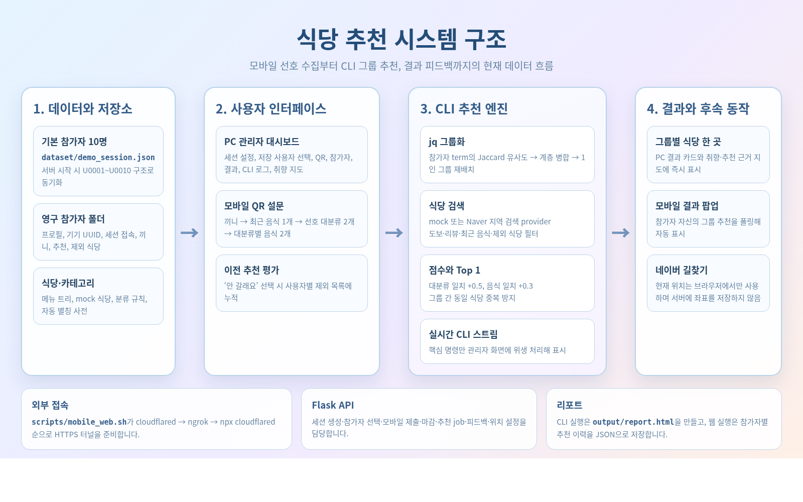

## 화면

PC 관리자 화면은 스크롤 없이 한 화면에서 세션 설정, QR, 참가자, 추천 결과, CLI 처리 상태와 그룹 취향·추천 근거를 함께 보여줍니다.

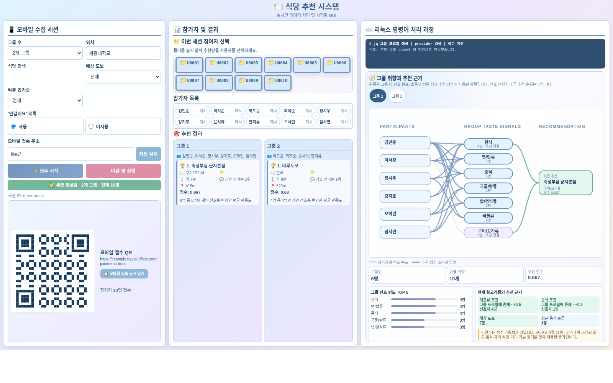

모바일 설문은 끼니 선택부터 최근 음식과 두 개의 선호 음식군 입력, 제출, 추천 확인까지 한 화면형 단계 UI로 진행됩니다.

| 첫 접속 | 최근 음식 선택 | 선호 음식 선택 |
|---|---|---|
| 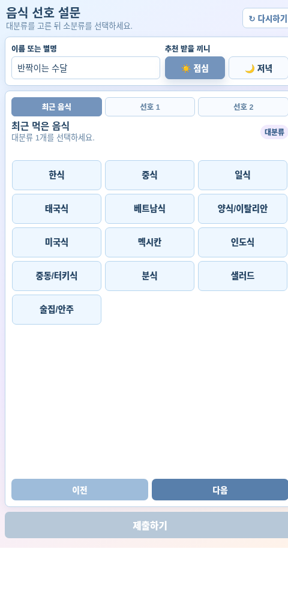 | 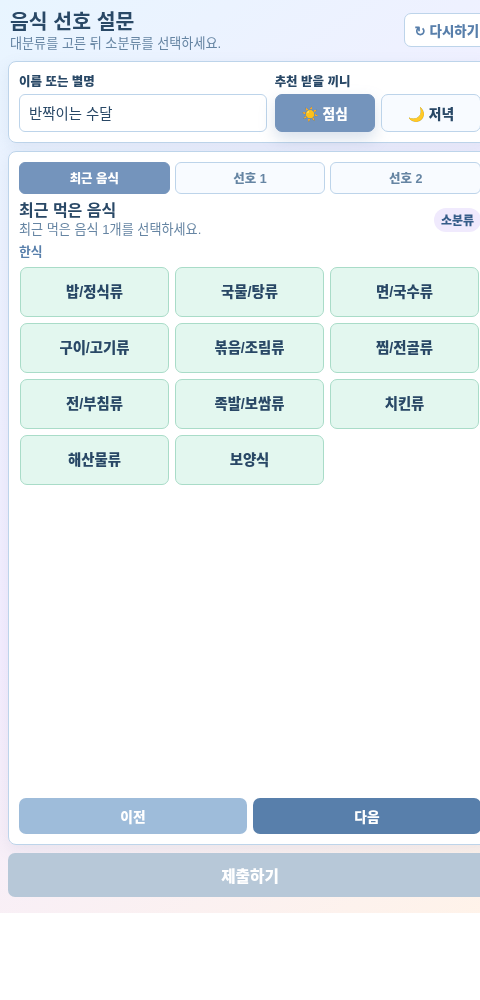 | 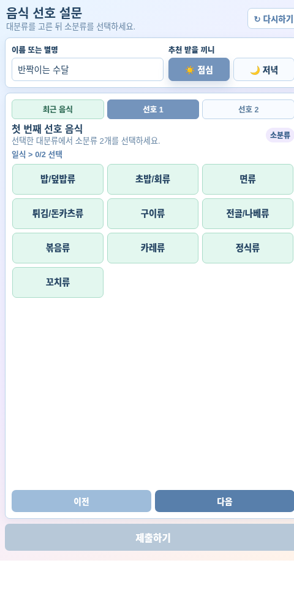 |

전체 모바일 동작 과정은 [모바일 설문 흐름](docs/MOBILE_FLOW.md)에서 단계별 이미지로 확인할 수 있습니다.

<details>
<summary><strong>모바일 전체 동작 과정 펼치기</strong></summary>

| 1. 첫 접속 | 2. 최근 음식 |
|---|---|
|  |  |

| 3. 선호 1 대분류 | 4. 선호 1 음식 |
|---|---|
| 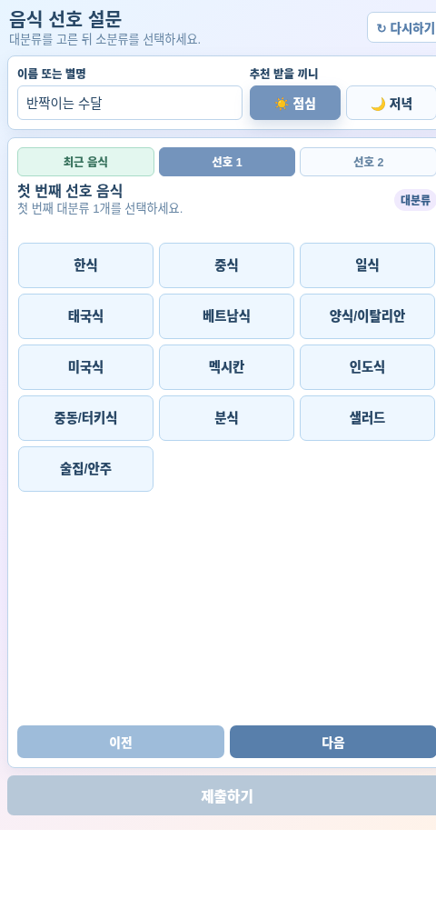 |  |

| 5. 선호 2 대분류 | 6. 선호 2 음식 |
|---|---|
| 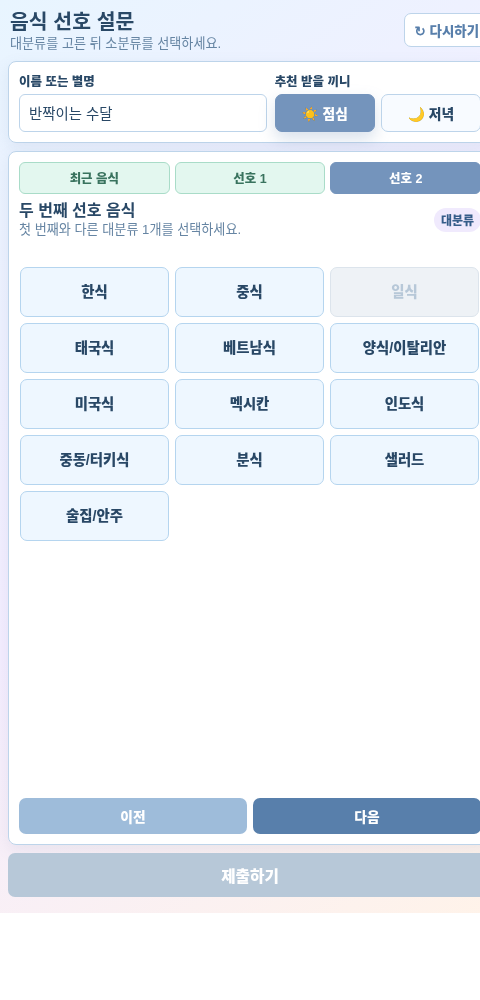 | 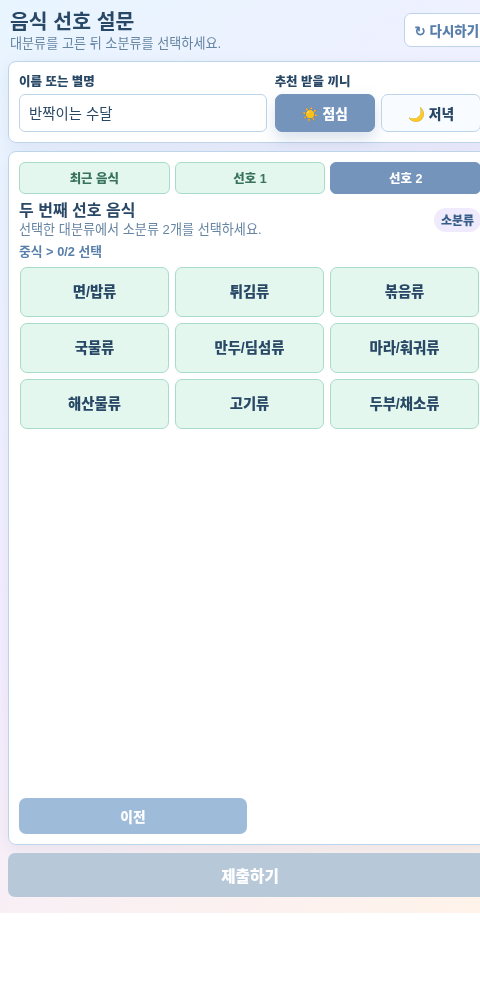 |

| 7. 제출 준비 | 8. 제출 완료 |
|---|---|
| 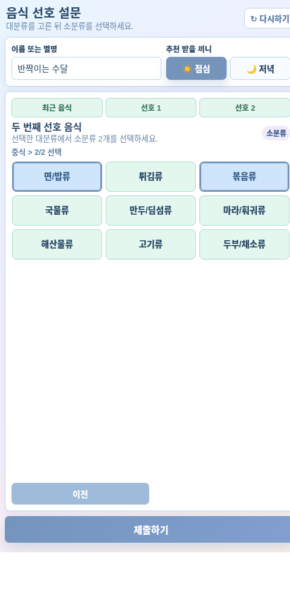 | 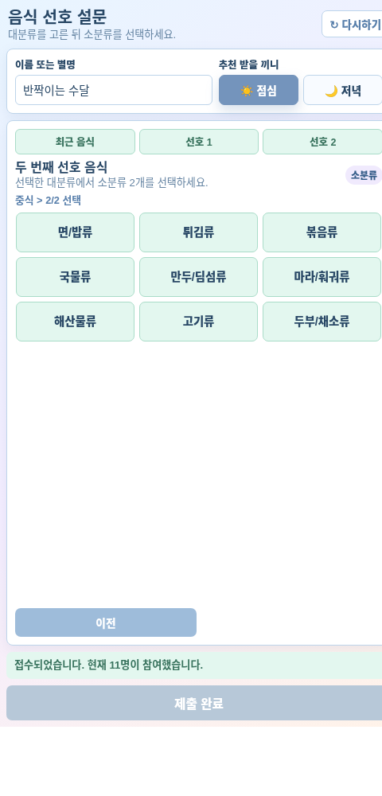 |

| 9. 이전 추천 평가 | 10. 최종 추천·길찾기 |
|---|---|
| 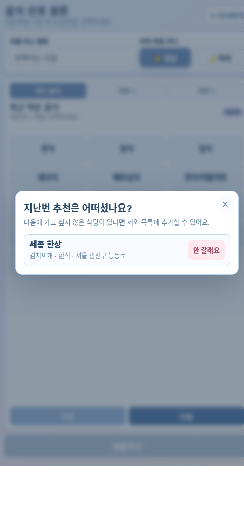 | 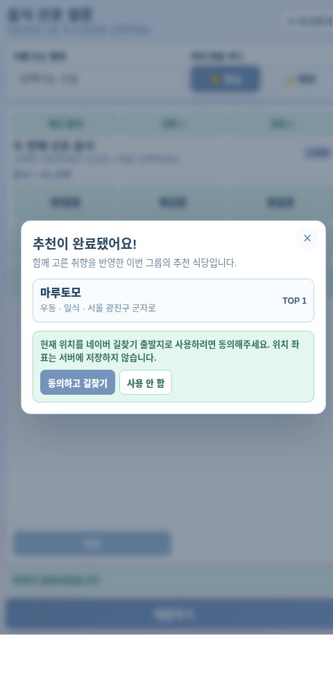 |

| 11. 네이버 길찾기 실행 |
|---|
| 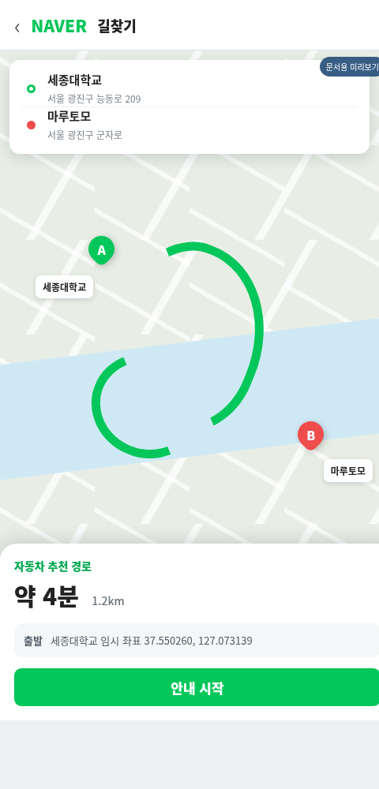 |

</details>

## 주요 기능

- 샘플 참가자 10명과 저장된 실제 사용자를 조합한 임시 추천 세션
- 브라우저 UUID 기반 사용자 식별과 `U0001` 형식의 영구 참가자 폴더
- 이름 미입력 시 형용사·동물 조합 자동 별칭
- 점심·저녁별 최신 설문 기록
- Jaccard 유사도와 계층 병합을 이용한 `jq` 기반 그룹화
- mock 또는 Naver 지역 검색 provider
- 예상 도보 시간, 리뷰 인기순, 최근 음식, 사용자별 제외 식당 필터
- 그룹별 추천 식당 중복 방지
- PC 무스크롤 대시보드와 실시간 CLI 핵심 단계 표시
- 참가자 → 그룹 취향 → 추천 식당 관계 시각화
- 모바일 이전 추천 평가와 `안 갈래요` 제외 목록
- 모바일 추천 완료 자동 확인과 네이버 지도 길찾기
- 독립 실행 가능한 HTML 결과 리포트

## 빠른 실행

### 1. 의존성

```bash
sudo apt update
sudo apt install -y jq python3 python3-pip python3-venv

python3 -m venv .venv
.venv/bin/python -m pip install -r requirements.txt
```

Python 패키지는 Flask만 필요합니다. 추천 파이프라인은 시스템의 `sh`, `jq`, `mktemp`를 사용합니다.

### 2. 웹 관리자 화면

```bash
.venv/bin/python src/app.py
```

기본 주소:

```text
http://127.0.0.1:5000
```

브라우저 자동 실행을 끄려면:

```bash
MM_AUTO_OPEN=0 .venv/bin/python src/app.py
```

포트를 변경하려면:

```bash
PORT=8000 .venv/bin/python src/app.py
```

### 3. 외부 모바일 QR 접속

```bash
sh scripts/mobile_web.sh
```

스크립트는 다음 순서로 사용 가능한 HTTPS 터널을 찾습니다.

1. `cloudflared`
2. `ngrok`
3. `npx --yes cloudflared`

이미 공개 URL이 있으면 터널 생성을 생략할 수 있습니다.

```bash
MM_PUBLIC_BASE_URL=https://example.com sh scripts/mobile_web.sh
```

### 4. API 없이 CLI 데모

```bash
sh scripts/recommend.sh --demo --without-mobile-responses --provider mock
```

실행 후 `output/report.html`이 생성됩니다.

## 웹 운영 순서

1. 관리자 화면에서 그룹 수, 위치, provider, 도보·리뷰 필터와 `안갈래요` 사용 여부를 정합니다.
2. 저장 사용자 폴더를 선택합니다. 샘플 참가자 10명은 항상 포함됩니다.
3. `접수 시작`을 누르면 세션과 QR 링크가 생성됩니다.
4. 참가자는 QR로 접속해 이름 또는 별명, 끼니와 음식 선호를 제출합니다.
5. 접수 중 저장 사용자 선택을 바꾸면 현재 세션에도 즉시 반영됩니다.
6. `마감 및 실행`을 누르면 모바일 접수가 닫히고 CLI 추천 job이 실행됩니다.
7. PC 화면에는 그룹 결과와 취향·추천 근거 지도가 표시됩니다.
8. 모바일 참가자는 자신의 그룹 추천을 자동으로 확인합니다.

세션은 참가자가 최소 2명씩 배정될 수 있는 그룹 수만 허용합니다. 기본 참가자 10명만 사용하는 경우 1~5개 그룹을 선택할 수 있습니다.

## 모바일 설문 입력

모바일 입력은 실제로 여섯 단계입니다.

1. 최근 음식 대분류 1개
2. 최근 음식 소분류 1개
3. 첫 번째 선호 대분류 1개
4. 첫 번째 대분류의 소분류 2개
5. 두 번째 선호 대분류 1개
6. 두 번째 대분류의 소분류 2개

두 번째 선호 대분류는 첫 번째와 달라야 합니다. 제출하려면 점심 또는 저녁도 선택해야 합니다. `다시하기`는 저장 프로필 자동 입력 없이 빈 설문으로 다시 시작합니다.

기존 사용자가 새 세션에 접속하면 직전 다른 세션의 추천을 평가할 수 있습니다. `안 갈래요`를 누른 식당은 해당 사용자의 `exclusions.json`에 저장됩니다.

## 추천 알고리즘

### 그룹화

`scripts/grouping_cli.sh`가 참가자의 선호 대분류와 `대분류|음식` term을 만듭니다.

1. 참가자 간 Jaccard 유사도를 계산합니다.
2. 평균 유사도가 가장 높은 두 클러스터를 합칩니다.
3. 요청한 그룹 수까지 반복합니다.
4. 1인 그룹이 생기면 3명 이상인 가장 큰 그룹에서 한 명을 재배치합니다.

### 후보 검색과 필터

그룹별 선호 term으로 식당을 검색한 뒤 다음 후보를 제거합니다.

- 그룹원이 최근 먹은 음식
- 그룹원의 `안 갈래요` 식당
- 앞 그룹이 이미 추천받은 식당
- 설정한 예상 도보 시간 또는 리뷰 인기순 범위를 벗어난 식당

거리·리뷰 조건 때문에 후보가 모두 사라지면 두 조건만 완화합니다. 그래도 후보가 없으면 Naver provider는 `음식점`, `맛집` 검색으로 범위를 넓힙니다. 최근 음식과 제외 식당 조건은 유지됩니다.

### 점수

```text
대분류가 그룹 프로필에 존재하면 +0.5
음식이 그룹 프로필에 존재하면 +0.3
```

현재 점수는 선호 인원수를 가중치로 사용하지 않습니다. PC 취향 지도에서 파란 선은 그룹 내 선호 분포, 초록 선은 실제 추천 점수 조건과 일치한 항목을 뜻합니다.

## CLI 사용법

```bash
# 대화형 참가자 입력
sh scripts/recommend.sh --collect-session --provider naver

# 기본 데모 + 최신 모바일 세션
sh scripts/recommend.sh --demo --provider mock

# 기본 데모만
sh scripts/recommend.sh --demo --without-mobile-responses --provider mock

# 특정 모바일 세션 결합
sh scripts/recommend.sh --demo --mobile-session-id SESSION_ID --provider mock

# 저장된 dataset/users.json 사용자
sh scripts/recommend.sh --user-id U01 --provider naver

# 웹 서버와 같은 세션 JSON 실행
sh scripts/recommend.sh \
  --session-file /tmp/session.json \
  --provider mock \
  --location 세종대학교 \
  --json-output
```

지원 옵션은 다음 명령으로 확인할 수 있습니다.

```bash
sh scripts/recommend.sh --help
```

## 환경변수

| 변수 | 기본값 | 설명 |
|---|---:|---|
| `PORT` | `5000` | Flask와 터널이 사용할 포트 |
| `PYTHON` | `.venv/bin/python` 또는 `python3` | `mobile_web.sh`가 사용할 Python |
| `MM_PUBLIC_BASE_URL` | 없음 | QR에 넣을 공개 기준 URL |
| `MM_AUTO_OPEN` | `1` | 관리자 화면 자동 열기 |
| `MM_NAVER_DIRECTIONS_ENABLED` | `1` | 모바일 네이버 길찾기 전체 활성화 |
| `MM_NAVER_REQUEST_DELAY_SEC` | `0.25` | Naver 음식 검색 사이 대기 시간 |
| `MM_STEP_DELAY_SEC` | 실행별 설정 | CLI 시각화 단계 사이 대기 시간 |
| `MM_VISUALIZER_SKIP_LIVE` | 없음 | HTML 리포트에서 추가 실시간 검색 생략 |
| `NAVER_CLIENT_ID` | 코드 기본값 | Naver 지역 검색 Client ID 재정의 |
| `NAVER_CLIENT_SECRET` | 코드 기본값 | Naver 지역 검색 Client Secret 재정의 |

Naver API 인증은 `NAVER_CLIENT_ID`, `NAVER_CLIENT_SECRET` 환경변수 또는 `src/naver_restaurant_api.py`의 CLI 인자를 사용합니다. API 키 없이 개발·검증할 때는 `mock` provider를 사용하세요.

## 문서

- [시스템 구조](docs/ARCHITECTURE.md)
- [모바일 설문 흐름과 전체 캡처](docs/MOBILE_FLOW.md)
- [Flask API](docs/API.md)
- [데이터 모델](docs/DATA_MODEL.md)

문서 이미지를 현재 템플릿으로 다시 생성하려면:

```bash
python3 scripts/capture_docs_screenshots.py
```

Google Chrome 또는 Chromium이 필요하며, 캡처는 미리보기 데이터만 사용하므로 참가자와 세션 파일을 변경하지 않습니다.

## 디렉터리

```text
dataset/                  세션·참가자·메뉴·식당 데이터
docs/                     구조 문서와 화면 캡처
output/                   생성된 HTML 리포트
scripts/recommend.sh      CLI 추천 진입점
scripts/grouping_cli.sh   jq 그룹화
scripts/mobile_web.sh     공개 HTTPS 모바일 실행
scripts/providers/        식당 provider dispatch
src/app.py                Flask 서버와 API
src/naver_restaurant_api.py
src/preference_utils.py
src/recommendation_visualizer.py
templates/index.html      PC 관리자 화면
templates/mobile.html     모바일 설문
```

## 참고

- 브라우저에서는 MAC 주소를 읽지 않습니다. `localStorage`의 UUID를 기기 식별자로 사용합니다.
- 위치 좌표는 네이버 길찾기 URL을 만드는 모바일 브라우저에서만 사용하며 서버에 저장하지 않습니다.
- Cloudflare 임시 URL은 터널 프로세스가 종료되면 사라지고 재실행 시 바뀔 수 있습니다.
- `dataset/participants/`와 `dataset/mobile_sessions.json`은 실제 운영 데이터이므로 백업 후 관리하세요.
