# 기능별 화면 스크린샷

전체 화면에서 기능별 레이아웃만 잘라낸 문서용 이미지입니다. 원본 전체 화면은 `docs/screenshots/`에, 아래 크롭 이미지는 `docs/screenshots/crops/`에 저장됩니다.

## PC 관리자 화면

### 세션 설정

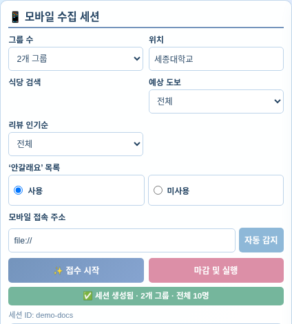

### 모바일 QR과 접속 링크

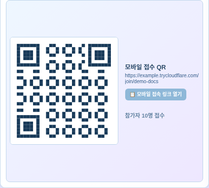

### 참가자와 추천 결과

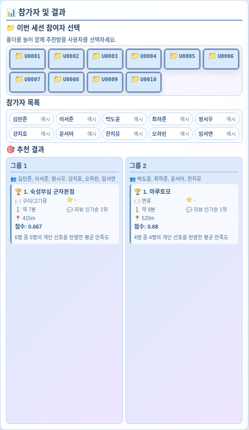

### CLI 처리 과정

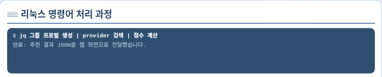

### 그룹 취향과 추천 근거

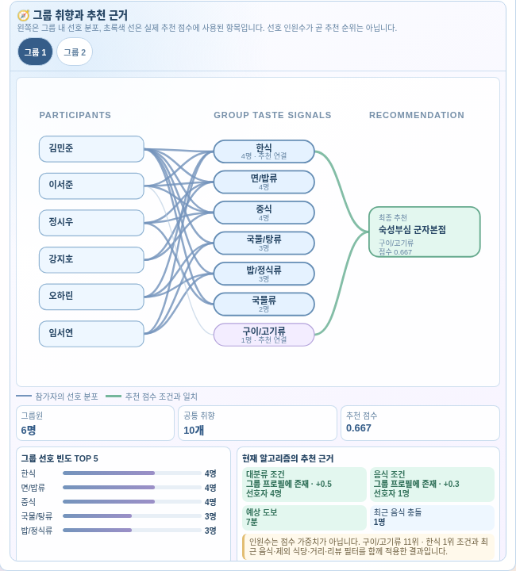

## 모바일 화면

### 사용자 정보와 끼니

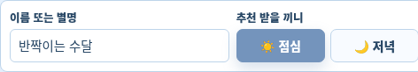

### 대분류 선택

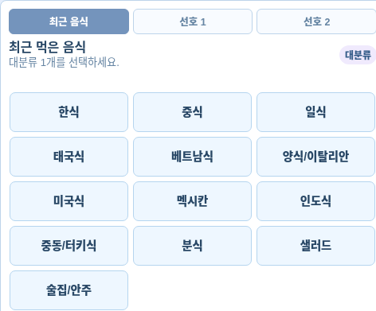

### 소분류 선택

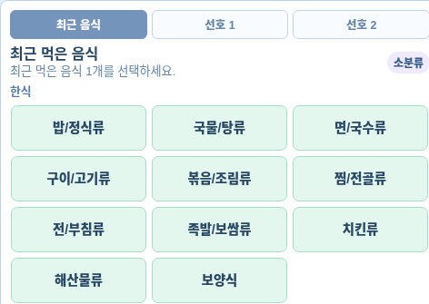

### 선호 선택과 제출

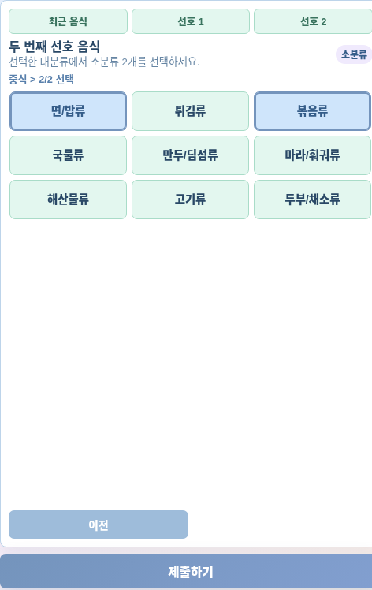

### 이전 추천 평가

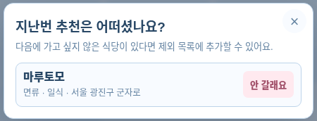

### 최종 추천

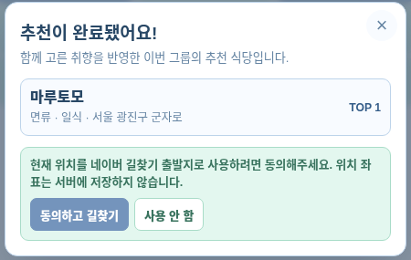

### 네이버 길찾기

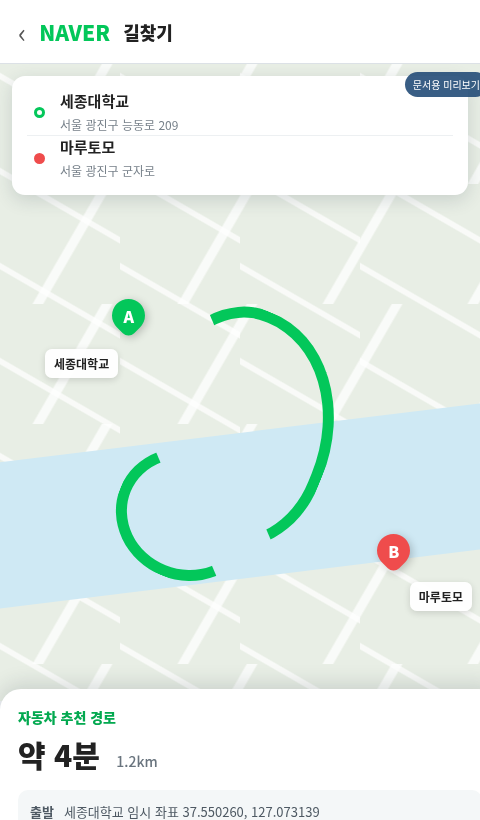
